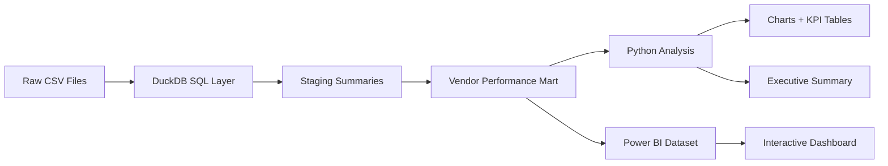

# Vendor Performance Analysis

An end-to-end analytics case study for evaluating vendor profitability, pricing efficiency, inventory turnover, and procurement concentration on large retail/wholesale datasets.

This repo is built as a portfolio-grade analytics project, not a classroom notebook. It follows the same business architecture as a company-style workflow:

`Raw CSV files -> SQL transformation layer -> analytics mart -> Python analysis -> Power BI dashboard -> executive report`

## Executive Snapshot

- `12.8M+` raw sales rows processed
- `2.37M+` raw purchase rows processed
- `10,692` vendor-brand mart rows created
- `8,564` dashboard-ready analysis rows retained
- `$441.41M` total sales analyzed
- `$134.07M` gross profit identified
- `$9.55M` unsold inventory exposure quantified
- `65.69%` of purchase dollars concentrated in the top 10 vendors

## Why This Repo Stands Out

- It combines `SQL + Python + Power BI` in one coherent business workflow.
- It uses a script-based ETL pipeline instead of depending on Jupyter for large-data processing.
- It includes logging, config, automated tests, and reusable outputs.
- It answers actual business questions instead of stopping at generic EDA.
- It packages dashboard assets, DAX, and report wording so the project is presentation-ready.

## Business Questions Solved

1. Which brands are low-sales but high-margin and should be targeted for pricing/promotion changes?
2. Which vendors and brands contribute the most to sales?
3. How concentrated is procurement across the top vendors?
4. Does buying in bulk reduce unit cost?
5. Which vendors have low inventory turnover and slow-moving stock?
6. How much capital is locked in unsold inventory?
7. Is the profit-margin difference between top and low performing vendors statistically significant?

## Architecture



## Tech Stack

- `DuckDB` for large-data local analytics without notebook instability
- `SQL` for raw views, transformations, summaries, and mart creation
- `Python` for analysis, statistical validation, and report generation
- `Power BI` handoff assets for executive dashboarding
- `GitHub Actions` workflow for repo-level validation

## Portfolio-Friendly Features

- business-problem framing
- reproducible script-first pipeline
- config-driven execution
- unit tests
- CI workflow
- Power BI theme + DAX starter pack
- executive summary wording
- resume-ready phrasing in [`docs/resume_ready_wording.md`](./docs/resume_ready_wording.md)

## Project Structure

```text
.github/workflows/
config/
data/
docs/
logs/
outputs/
  charts/
  powerbi/
  reports/
  tables/
sql/
src/vendor_performance/
templates/
tests/
vendor_powerbi/
main.py
```

## Run Locally

Create the environment and install dependencies:

```powershell
python -m venv .venv
& .\.venv\Scripts\python.exe -m pip install -r requirements.txt
```

Run the full pipeline:

```powershell
& .\.venv\Scripts\python.exe main.py all
```

Run only the mart build:

```powershell
& .\.venv\Scripts\python.exe main.py etl
```

Run only the analysis/report layer:

```powershell
& .\.venv\Scripts\python.exe main.py analyze
```

Run tests:

```powershell
& .\.venv\Scripts\python.exe -m unittest discover -s tests -v
```

## Key Outputs

- `analytics.duckdb`
  - persistent local analytics database
- `outputs/powerbi/vendor_performance_powerbi.csv`
  - full mart export
- `outputs/powerbi/vendor_performance_dashboard_ready.csv`
  - filtered dashboard-ready dataset aligned to analysis logic
- `outputs/tables/*.csv`
  - reusable tables for business questions and supporting visuals
- `outputs/charts/*.png`
  - report/dashboard visuals
- `outputs/reports/executive_summary.md`
  - stakeholder-ready summary

## Power BI Package

The Power BI assets are bundled in [`vendor_powerbi`](./vendor_powerbi):

- [`vendor_powerbi/measures.dax`](./vendor_powerbi/measures.dax)
- [`vendor_powerbi/theme_modern.json`](./vendor_powerbi/theme_modern.json)
- [`vendor_powerbi/dashboard_spec.md`](./vendor_powerbi/dashboard_spec.md)
- [`vendor_powerbi/dashboard_build_guide.md`](./vendor_powerbi/dashboard_build_guide.md)

## GitHub Dashboard Presentation

For recruiter visibility, keep the dashboard assets in a dedicated [`powerbi`](./powerbi) folder:

- `powerbi/pbix/`
  - save your final `.pbix` or `.pbit` here once you finish it in Power BI Desktop
- `powerbi/screenshots/`
  - export one screenshot per dashboard page
- [`powerbi/README.md`](./powerbi/README.md)
  - quick dashboard overview, screenshots, and optional Power BI Service link

This makes the dashboard easy to understand even for recruiters who will never download a `.pbix` file.

## Repo Pitch

This project demonstrates that I can:

- work with large raw operational datasets
- model a business problem into measurable KPIs
- build a SQL transformation layer and reusable mart
- validate findings statistically in Python
- hand off a polished dashboard package for stakeholders

## Notes

- The pipeline keeps all generated files inside `D:\projects\data analytics`, including temp spill, logs, exports, and outputs.
- DuckDB was chosen intentionally because it fits the machine constraints better than notebook-heavy SQLite or a full local Postgres load for this dataset size.
- If you want a cloud migration later, the path is documented in [docs/cloud_option.md](./docs/cloud_option.md).
